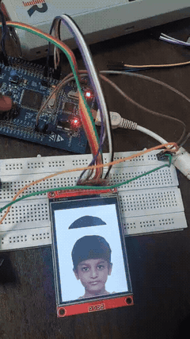
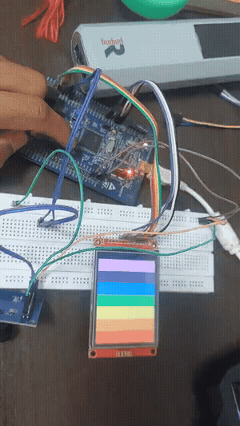

# STM32F407 Bare-Metal TFT Display Driver (ILI9341)

A register-level display driver and graphics projects for the **STM32F407VG** microcontroller driving an **ILI9341 TFT LCD** — written from the reference manual and datasheet, **without STM32 HAL or any vendor library**. The driver is packaged as a reusable BSP static library (`libbsp_lcd.a`) consumed by multiple demo applications.

## 🎬 Demo

*Slideshow application cycling images on the ILI9341 panel:*



*VIBGYOR color-bar test pattern:*



Full-quality recordings: [slide_show.mp4](output_video/slide_show.mp4) · [vibgyor_bar.mp4](output_video/vibgyor_bar.mp4)

## Highlights

- **No HAL, no CMSIS device pack** — peripheral access is done through a hand-written device header (`common/stm32f407xx.h`) and register-manipulation utilities (`common/reg_util.h`), built directly from the STM32F407 reference manual (RM0090).
- **Reusable BSP architecture** — the ILI9341 driver (`bsp_lcd`) builds as a static library with a clean public API (`bsp_lcd.h`), keeping applications decoupled from panel and pin details. Command/register definitions live in `ili9341_reg.h`.
- **Custom link-time configuration** — separate linker scripts for FLASH (`STM32F407VGTX_FLASH.ld`) and RAM execution (`STM32F407VGTX_RAM.ld`), plus the Cortex-M4 startup file with the vector table and reset handler.
- **Image rendering from C arrays** — the slideshow app renders full-frame images stored as `const` pixel arrays in flash (`iniyaal.c`, `pavithiran.c`), converted from PNG sources.

## Hardware

| Item | Details |
|---|---|
| MCU board | STM32F407 Discovery (STM32F407VGT6, Cortex-M4 @ 168 MHz) |
| Display | ILI9341-based TFT LCD, 240×320 |
| Interface | SPI2 (polling, up to 21 MHz — APB1 42 MHz / 2) |
| Debug probe | On-board ST-LINK |

### Wiring

| ILI9341 pin | STM32 pin | Function |
|---|---|---|
| SCK | PB13 | SPI2 clock |
| SDI (MOSI) | PB15 | SPI2 data out (MCU → LCD) |
| SDO (MISO) | PC2 | SPI2 data in (LCD → MCU) |
| CSX | PD11 | Chip select |
| DCX | PD9 | Data/Command select |
| RESX | PD10 | Panel reset |

Pin assignments are defined in `bsp_lcd/Inc/bsp_lcd.h` (`LCD_*_PIN` / `LCD_*_PORT` macros).

## Repository structure

```
Display/
├── common/                  # Shared bare-metal headers
│   ├── stm32f407xx.h        #   Hand-written device/register definitions
│   └── reg_util.h           #   Register set/clear/read-modify-write helpers
├── bsp_lcd/                 # ILI9341 driver — builds as static library
│   ├── Inc/bsp_lcd.h        #   Public driver API
│   ├── Inc/ili9341_reg.h    #   ILI9341 command & register definitions
│   └── Src/bsp_lcd.c        #   Init sequence, windowing, pixel/frame writes
├── 001_Vibgyor_bars/        # App: VIBGYOR color-bar test pattern
└── slide_show/              # App: image slideshow from flash-resident bitmaps
    ├── Src/main.c
    ├── Src/iniyaal.c        #   Image data as C array
    ├── Src/pavithiran.c     #   Image data as C array
    ├── Startup/startup_stm32f407vgtx.s
    ├── STM32F407VGTX_FLASH.ld
    └── STM32F407VGTX_RAM.ld
```

## How it works

1. **Clock & GPIO bring-up** — RCC and GPIO registers are programmed directly to enable peripheral clocks and configure alternate-function pins for the display interface.
2. **Panel initialization** — `bsp_lcd` sends the ILI9341 power-on sequence (sleep-out, pixel format, memory access control, display-on) as command/parameter transactions.
3. **Drawing** — the driver exposes window-addressing primitives (column/page address set + memory write), on top of which apps fill rectangles or stream full frames.
4. **Slideshow** — images are converted offline from PNG to RGB565 C arrays and streamed from flash to the panel in a timed loop.

<!-- If you use DMA for pixel streaming or measured a frame rate, say so here — numbers impress. -->

## Building & flashing

Projects are STM32CubeIDE projects (arm-none-eabi-gcc):

1. `git clone https://github.com/<your-username>/STM32-TFT-Interfacing.git`
2. In STM32CubeIDE: **File → Import → Existing Projects into Workspace**, select the `Display/` folder.
3. Build `bsp_lcd` first (produces `libbsp_lcd.a`), then build an application project (`slide_show` or `001_Vibgyor_bars`).
4. Flash via the Run/Debug configuration (`slide_show.launch` included) using the on-board ST-LINK.

## Roadmap

- [ ] FreeRTOS port — render task + input task with queue-based frame requests
- [ ] DMA-driven pixel streaming with transfer-complete interrupts
- [ ] Simple graphics primitives layer (lines, fonts)
- [ ] Low-power display sleep/wake

## Author

**Sivaprakash Natesan** — embedded software engineer (firmware, RTOS, embedded Linux)
<!-- add LinkedIn / GitHub profile links -->
